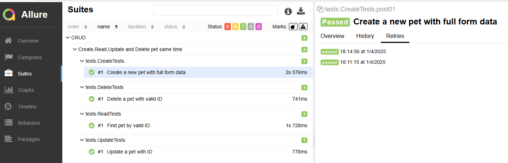

# <span style="font-family:Courier New"> PetStore Swagger API Tests 

---

This project prepared for creating automate test scenarios for the "pet" endpoints in the PetStore Swagger API document using RestAssured.
Includes POST, GET, PUT and DELETE requests.

Postman Collection :
[PetStoreSwagger.postman_collection.json](./petStoreSwagger.postman_collection.json)

##  🚀 <span style="color:red ;font-family:Courier New">Tech Stack</span>

- **Java 17**: Main programming language of the project
- **Maven**: Project and dependency management
- **TestNG**: Structuring and executing the tests
- **Allure Reports**:Generating test reports


## 💻 <span style="color:yellow;font-family:Courier New">Project Structure</span>

- **`src/test/java/baseUrls`**: Contains base url classes that create an endpoint with RequestSpecBuilder
- **`src/test/java/pojos`**: Contains POJO classes typically involved in testing scenarios 
- **`src/test/java/testDatas`**: Contains test data classes for use in test scenarios
- **`pom.xml`**: xml file that manages all dependencies used in the project
- **`CRUD.xml`**: xml file for CRUD operations (batch test execution)


## 🛠️ <span style="color:purple;font-family:Courier New">Installation</span>

1. Clone this repository:
    ```bash
    git clone https://github.com/gulpembege/petStoreAPI.git 
    ```

2. Install the required dependencies:
    ```bash
    mvn clean install
    ```

3. Run tests:
    ```bash
    mvn test
    ```


##  👥 <span style="color:orange;font-family:Courier New">Test Scenarios</span>

- **POST - post01 : Create a new pet with full form data** 
- **POST - post02 : Create a new pet image with ID** 
- **GET -get01 : Find pet by valid status**
- **GET -get02 : Find pet by valid ID**
- **GET -get03 : Find pet by invalid ID**
- **PUT -put01 : Update a pet with ID**
- **DELETE -del01 : Delete a pet with valid ID**
- **DELETE -del02 : Delete a pet with invalid ID**

## 📊 <span style="color:green;font-family:Courier New">Reporting</span>

- **Allure Report:** Test results are documented in reports generated by Allure, 

     For allure results: `mvn serve:allure`  
# Test Suite result for CRUD operation
  

 


